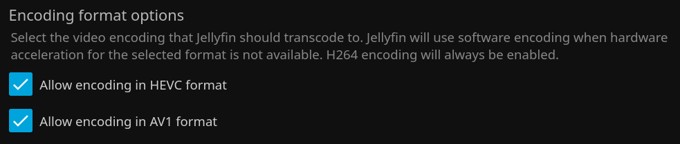

# igpu-passthrough

Intel processors have a video transcoding feaure called [Intel Quick Sync Video](https://en.wikipedia.org/wiki/Intel_Quick_Sync_Video). This is a dedicated hardware core for processing video files. It has integrated logic for handling various video codecs and converting them for use on different types of clients. This is notably convenient for Jellyfin, which has inbuilt settings that will make use of this feature.

## Device Driver

Most Linux systems _should_ automatically detect this driver, I imagine, but my only anecdotal experience is through Debian. It's will show up under `/dev/dri`.

```
demo@pve:~$ ls -l /dev/dri
total 0
drwxr-xr-x 2 root root         80 Oct 20 09:37 by-path
crw-rw---- 1 root video  226,   0 Oct 20 09:37 card0
crw-rw---- 1 root render 226, 128 Oct 20 09:37 renderD128
demo@pve:~$ getent group video
video:x:44:
demo@pve:~$ getent group render
render:x:104:
```

## Passthrough to LXC

On Proxmox you can pass this driver through to your LXC by adding it to the LXC configuration file under `/etc/pve/lxc/xxx.conf` where `xxx` is the ID of your container.

```
dev0: /dev/dri/card0,gid=44,uid=0
dev1: /dev/dri/renderD128,gid=105,uid=0
```

Restart the LXC using `pct`.

```
sudo pct stop xxx
sudo pct start xxx
```

The device should now show up when you ssh into your container.

```
demo@jellyfin:~$ ls /dev
console  dri  full       initctl  mqueue  ptmx  random  stderr  stdout  tty1  urandom
core     fd   hugepages  log      null    pts   shm     stdin   tty     tty2  zero
demo@jellyfin:~$ ls /dev/dri
card0  renderD128
```

## Passthrough to Docker

Since I have Jellyfin running inside Docker on my LXC, the driver needs to be passed through to this container as well. In my Docker compose file I added the following under `devices`.

```
services:
  jellyfin:
    image: jellyfin/jellyfin:latest
    container_name: jellyfin
    network_mode: "host"
    devices:
      - '/dev/dri:/dev/dri'
```

You can now see the device inside of the container.

```
demo@jellyfin:~/jellyfin$ sudo docker exec -it jellyfin /bin/bash
root@jellyfin:/# ls /dev
core  dri  fd  full  mqueue  null  ptmx  pts  random  shm  stderr  stdin  stdout  tty  urandom  zero
root@jellyfin:/# 
```

## Jellyfin Settings

Intel Quick Sync ("QSV") is enabled in Jellyfin by going to the administrative dashboard then clicking on **Playback** and selecting the **Transcoding** sub-menu.


12th gen or higher Intel CPUs will support all of the codecs listed here.



I enabled hardware encoding for HVEC and AV1. AV1 was needed for my Tvheadend stream. 11th gen CPUs do not support AV1 encoding.


Toggle on these options under **Trickplay**, it's for thumbnail generation.

## Monitoring

You can install `intel-gpu-top` on your Jellyfin LXC and watch its performance and to confirm that the iGPU is being used for transcoding.


